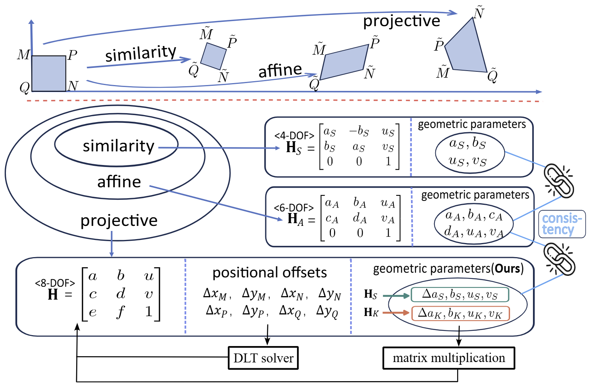
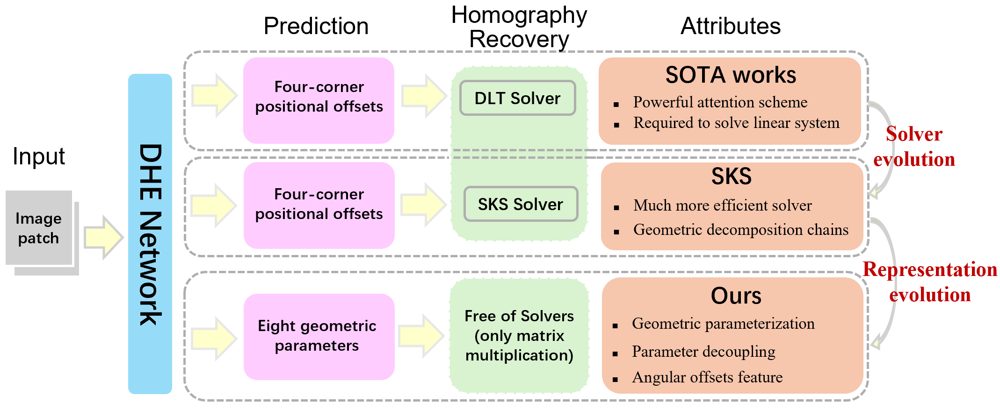
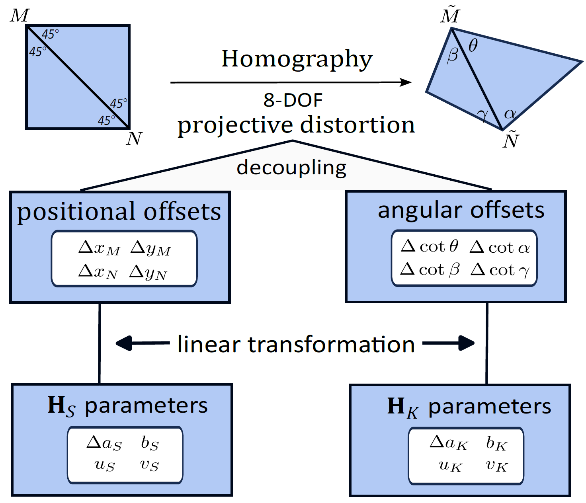

# DeepSKS: Decoupled Geometric Parameterization upon SKS for Deep Homography Estimation

This repository is the official implementation of the paper: 

**Decoupled Geometric Parameterization and its Application in Deep Homography Estimation**.

__Authors:__ Yao Huang, Siyuan Cao, Yaqing Ding, Hao Yin, Shibin Xie, Zhijun Fang, Jiachun Wang, Shen Cai, Junchi Yan, Shuhan Shen.

<!-- **Links:**  [[Paper]](https://arxiv.org/pdf/2402.18008) -->

## 💡 Motivation

The **Similarity-Kernel-Similarity ([SKS](http://www.cscvlab.com/research/SKS-Homography/))** decomposition is an efficient and interpretable method for homography computation, which we originally proposed approximately seven years ago. In the deep learning era, SKS can be employed as a post-processing solver to estimate homography from four-point positional offsets predicted by neural networks. However, this work aims to address a deeper, long-standing problem: **how to represent a homography using eight geometric parameters**.

Geometric parameterization of homography aligns conceptually and structurally with existing parameterizations for similarity and affine transformations (see the figure below). Furthermore, it complements the broader family of solver-free estimations, such as translation and rotation in relative pose estimation or 3D point cloud prediction in stereo reconstruction.

<p align="center">
  
</p>

While [SKS](http://www.cscvlab.com/research/SKS-Homography/) decomposes a homography into geometrically meaningful sub-transformations, its adaptation to deep homography estimation (DHE) is non-trivial. Three central challenges arise: (1) Which eight geometric parameters are suitable for neural network prediction? (2) How can parameters be optimally estimated across stratified sub-transformations? (3) How to endow geometric parameters with a direct interpretation in terms of image feature?  

To tackle these challenges, we propose a **decoupled geometric parameterization** based on the SKS decomposition, tailored for DHE. Our contributions advance SKS in the following key areas:

1. **Geometric Parameterization Design**: While SKS allows various decompositions involving more than eight parameters, we identify a specific, compact subset of eight parameters suitable for DHE, fixing the rest parameters as known.

2. **Parameter Decoupling**: Although SKS’s stratified decomposition initially implied a dependency of the kernel transformation $\mathbf{H}_K$ on the similarity transformation $\mathbf{H}_S$, our analysis reveals that two independent four-parameter groups can be learned in parallel.

3. **Angular Offsets Feature**: We introduce **angular offsets (A.O.)** as a novel point-level visual feature and empirically validate their robustness and relevance in homography estimation.

The pipeline comparison between SOTA DHE methods, the original SKS, and our proposed method is illustrated in the following figure:

<p align="center">
 
</p>


## 🔬 Formula Breakdown

### Original SKS Decomposition
[SKS](http://www.cscvlab.com/research/SKS-Homography/) decomposes a 2D homography into three sub-transformations: 
```math
\mathbf{H}=\mathbf{H}_{S_2}^{-1}*\mathbf{H}_{K}*\mathbf{H}_{S_1},
```
where $\mathbf{H}\_{S\_1}$ and $\mathbf{H}\_{S\_2}$ are similarity transformations induced by two arbitrary pairs of corresponding points on source plane and target plane, respectively; $\mathbf{H}\_{K}$ is the 4-DOF kernel transfromation we defined, which generates projective distortion between two similarity-normalized planes. In the original SKS, $\mathbf{H}\_{K}$ is associated with the hyperbolic similarity transformation $\mathbf{H}\_{S}^{'}$.

### 8-DOF Geometric Parameterization upon SKS

In this paper, the homography $\mathbf{H}$ from the source image to the target image is represented by:

```math
\mathbf{H} = \mathbf{H}_{T}^{-1}*\mathbf{H}_{S}*\mathbf{H}_{T}*\mathbf{H}_{S_3}^{-1}*\mathbf{H}_{K}*\mathbf{H}_{S_3},
```
where the similarity transformation $\mathbf{H}\_{S\_3}$ and the translation $\mathbf{H}\_{T}$ are known; The unknown similarity transformation $\mathbf{H}\_{S}$ is expressed by 
```math
\mathbf{H}_{S} =\begin{bmatrix} 
\Delta a_{S}+1 & -b_{S} & u_{S} \\
b_{S} & \Delta a_{S}+1 & v_{S} \\
0 & 0 & 1
\end{bmatrix},
```

and the unknown kernel transformation $\mathbf{H}\_{K}$ is expressed by

```math
\mathbf{H}_{K} = \begin{bmatrix} 
\Delta a_{K}+1 & u_{K} & b_{K} \\ 
0 & 1 & 0 \\ 
b_{K} & v_{K} & \Delta a_{K}+1
\end{bmatrix}.
```

The above equations introduce an 8-DOF geometric parameterization for homography, four in $\mathbf{H}\_{S}$ and four in $\mathbf{H}\_{K}$.

### Parameter Decoupling

The proposed eight geometric parameters can be **decoupled into two independent sets of four parameters**, each corresponding to the 2-DOF features of two distinct point vertices. Specifically:

* The four parameters in $\mathbf{H}\_{S}$ (the similarity transformation) are linearly related to the **positional offsets** of two vertices. The relationships are given by:

$$
\Delta x_{M} = \quad r \cdot \Delta a_{S} + \quad r \cdot b_{S} - u_{S},
$$

$$
\Delta y_{M} = -r \cdot \Delta a_{S} + \quad r \cdot b_{S} - v_{S},
$$

$$
\Delta x_{N} = -r \cdot \Delta a_{S} - r \cdot b_{S} - u_{S},
$$

$$
\Delta y_{N} = \quad r \cdot \Delta a_{S} - r \cdot b_{S} - v_{S}.
$$

* The four parameters in $\mathbf{H}\_{K}$ (the kernel transformation) are linearly related to the **angular offsets** of the same two vertices. These are expressed via differences in cotangent values from a canonical $45^\circ$ reference angle:

$$
\Delta \cot \theta = \cot \theta - \cot 45^\circ = \Delta a_{K} + b_{K} + u_{K} + v_{K},
$$

$$
\Delta \cot \alpha = \cot \alpha - \cot 45^\circ = \Delta a_{K} - b_{K} - u_{K} + v_{K},
$$

$$
\Delta \cot \beta = \cot \beta - \cot 45^\circ = \Delta a_{K} + b_{K} - u_{K} - v_{K},
$$

$$
\Delta \cot \gamma = \cot \gamma - \cot 45^\circ = \Delta a_{K} - b_{K} + u_{K} - v_{K}.
$$

---

The above formulation demonstrates that **positional and angular features can be learned independently from two images**, as shown below, enabling parallel prediction and facilitating more interpretable homography estimation. 

<p align="center">
 
</p>

## 📜 Application to Deep Homography Estimation

### Network Architecture 
Our method is designed to be **architecture-agnostic** and integrates seamlessly into existing DHE methods. No changes are made to the backbone network structure. Instead, the proposed geometric parameterization replaces the conventional eight positional offsets. For iterative DHE models, this substitution shifts the homography computation step from solving a linear system (based on four-point offsets) to a direct matrix multiplication using the predicted geometric parameters.

### Loss Function
Similar to previous methods, we adopt a straightforward supervised learning objective, applying an **$L_1$ loss** to the predicted eight geometric parameters.

### Unified Framework for 2D transformation Estimation
The proposed geometric parameterization naturally extends to a **unified framework for estimating various 2D transformations**. In particular:

* For **affine transformations**, the structure of the four angular parameters $\{\theta, \alpha, \beta, \gamma\}$ allows straightforward identification of affine distortions. Specifically, a parallelogram pattern is indicated when $\theta = \gamma$ and $\alpha = \beta$.
* Under a **4-DOF similarity transformation**, the same four angles remain invariant at $45^\circ$, providing a clear signature for similarity transformations.

This ability to identify **degenerate cases** (e.g., affine or similarity) from within the 8-DOF homography parameter enhances interpretability and supports broader applications.

### Experimental Results
We evaluate the method across multiple DHE networks on three commonly used datasets. Our findings include:

* **Slight improvement** in positional offset metrics, reflecting modest gains in point alignment accuracy;
* **Significant reduction** in **angular offset errors**, highlighting the robustness and precision of our proposed representation in capturing orientation-related distortions.

